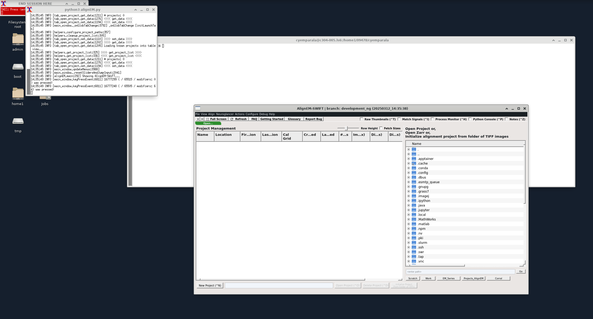

# About
This is Align Swift Dev app. This is interactive app.

## App build details

1. This app uses app from https://github.com/mcellteam/swift-ir.git and development_ng branch.

## Usage
App is used in 3DEM mainly and deployed in portals tenant. CEP (dev and prod) can be used for testing.

## Inputs
This is an interactive with no additional input. 

## Outputs
See examples/output which shows how the app looks when it launches. This is the verification part. Hit enter in the red terminal to close the app.

 

## Details on how this app is launched

1. The app runs from a wrapper script instead of docker container.
2. The wrapper script is invoked via cmdPrefix attribute in app.json.
3. The docker container is a no-op with just an echo statement.
4. The runner script is mostly similar to AlignEM tapis v2 runner script.

## Note
Using container with AlignEM Swift app resulted in conflicts with dcv libraries and mounted paths. This is the reason for using a 
run script with no-op container.

The no-op container is debian based. Other alternative is to use alpine, but it resulted in errors starting up container.