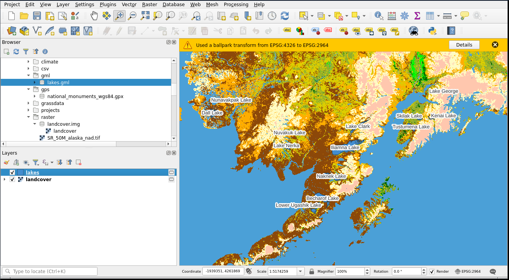

# About
QGIS is a free and open-source geographic information system that supports viewing, editing, and analysis of geospatial data. It enables users to create, visualize, and manipulate vector and raster datasets for research and decision-making.

## App build details
Uses Apptainer: docker://taccaci/qgis_express:3.36
Based on: taccaci/interactive-base:1.1.0
Runs on: LS6

## Usage
In DS, it's listed under 'GIS Tools'
In CEP, UTRC, and PTDataX, it's listed under 'Data Processing'

## Inputs
There is sample data in /corral-repl/tacc/aci/CEP/community/app_examples/qgis/

1. Start the interactive app.
2. In QGIS, use Layer → Add Layer or Project → Open to load spatial datasets (e.g., shapefiles, GeoTIFFs).
3. You can also drag and drop files from your workspace into the QGIS window.

## Outputs

1. Verify basic functionality: layer visibility toggles, attribute table access, styling, measuring tools, and layout composer.
2. Check processing toolbox availability for spatial analysis.
3. Confirm Python Console opens and can run simple PyQGIS commands.

Example output from completing this tutorial: https://docs.qgis.org/3.40/en/docs/user_manual/introduction/getting_started.html
 

## Details on how this app is launched

1. CEP pulls the QGIS Apptainer image (docker://taccaci/qgis_express:3.36) onto the LS6 node.
2. Image is built FROM taccaci/interactive-base:1.1.0, which includes helper scripts, DCV support, and common TACC modules.
3. The user's working directory is bind-mounted into the container.
4. An interactive SLURM job is launched.
5. Webhooks are registered at job start for handling connection events and job monitoring.

## Note