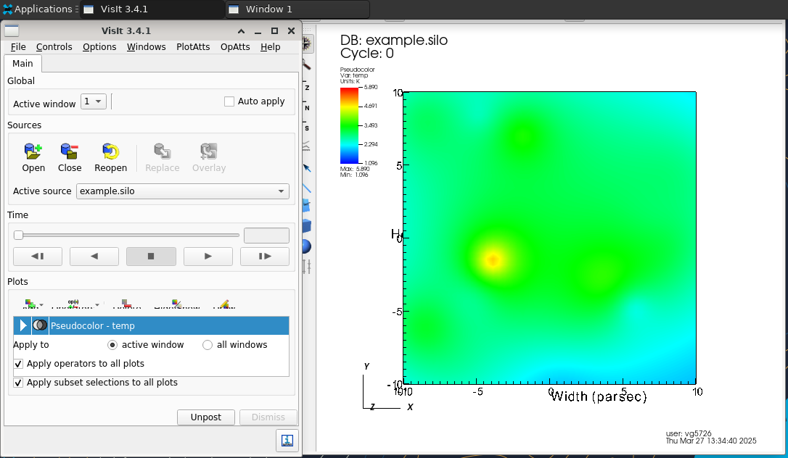

# About
VisIt is an Open Source, interactive, scalable, visualization, animation and analysis tool. 

## App build details
No container needed — this app is built natively on Stampede3.

## Usage
In DesignSafe, it is under 'Visualization'. It runs on Stampede 3.

## Inputs
Input taken from https://visit-sphinx-github-user-manual.readthedocs.io/en/develop/tutorials/VisIt_Basics.html

1. In Data Depot, create a folder (visit_example), add 'example.silo' to this folder. 
    <i> The file, example.silo, can be found in the 'Download' link in Step 1 of 1.3 'Opening files' </i>
2. In VisIt (Stampede3), for the Working Directory, select the folder. 
3. Start the interactive session.

Once in the session, follow the steps in 1.4 'Making a plot'

## Outputs

 

## Details on how this app is launched
1. Wrapper script from ZIP template starts DCV/VNC + runs visit
2. No container, no Docker, no MPI
3. Modules handle the VisIt environment (purge, TACC, intel, impi, visit)
4. Scheduler profile and job-name flags are critical for interactive desktop routing

## Note
